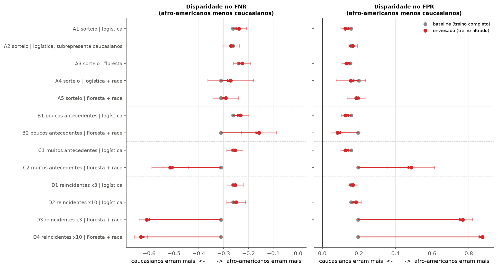

# Predictive Justice – Bias Analysis

**Cenário 5: Avaliação de Risco e Segurança Pública (COMPAS)**

Estudo de caso em Python: sub-representar intencionalmente um grupo étnico/racial no conjunto de
treinamento do COMPAS (ProPublica) e mostrar como isso gera taxas de erro díspares entre os grupos.

## Abrir no Colab

[](https://colab.research.google.com/github/ibgrilo/predictive-justice-bias-analysis/blob/main/notebooks/cenario5_compas.ipynb)

O notebook baixa o CSV direto do GitHub do ProPublica, então não precisa do submódulo. O link só funciona depois do push.

## Resultado principal



Cada linha é um caso (modelo, uso de `race`, método de amostragem), com 30 sementes. O ponto cinza é a disparidade do baseline (treino completo) e o vermelho é a do modelo com um grupo subrepresentado (10% do treino).

- Subrepresentar o grupo por **sorteio** muda os dois grupos juntos, e a diferença entre eles fica dentro do ruído entre sementes.
- A disparidade aparece com **amostragem seletiva** (por antecedentes ou por resultado) e floresta com `race`. No pior caso (D4), o FPR dos afro-americanos vai de 32% para 99,9%.
- No exemplo da seção 3, a acurácia dos afro-americanos fica em 67,5% antes e 67,4% depois, enquanto FNR e FPR se deslocam mais de 4 p.p. Só olhar a acurácia esconde o problema.

Os outros gráficos estão em [`docs/figures/`](docs/figures) e o notebook já traz os outputs salvos.

## Estrutura

```
data/compas-analysis/   submódulo git com os dados do ProPublica (propublica/compas-analysis)
docs/                   enunciado do seminário e figuras (docs/figures)
notebooks/              cenario5_compas.ipynb (estudo de caso completo)
src/                    código reutilizável (filtros, treino, métricas)
```

## Como rodar

```bash
git clone --recurse-submodules https://github.com/ibgrilo/predictive-justice-bias-analysis.git
pip install -r requirements.txt
```

Se já clonou sem `--recurse-submodules`: `git submodule update --init`.

## Dados

Base: [ProPublica COMPAS](https://github.com/propublica/compas-analysis) (Broward County).
